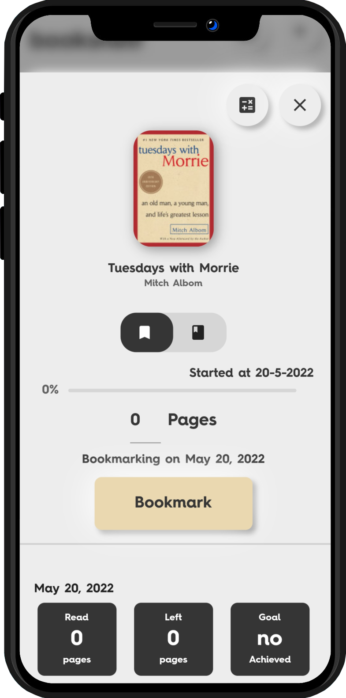
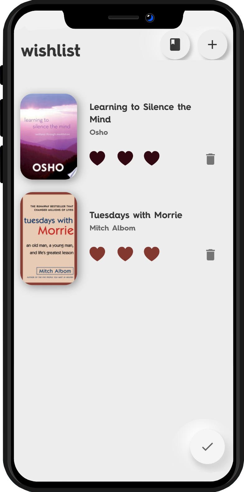
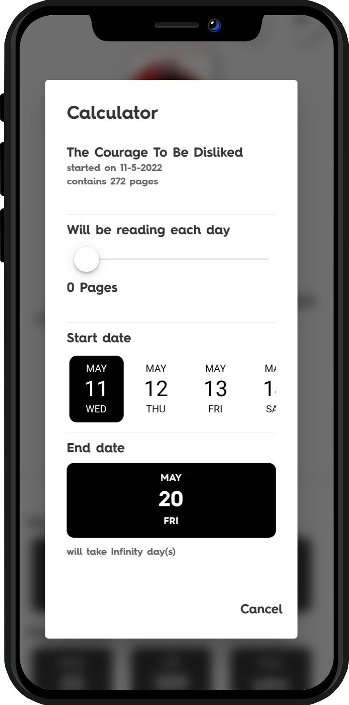

## Book Tracker App
[](https://flutter.dev/)
[](https://dart.dev/)

This project is a comprehensive book management application built using Flutter and Dart. It features a sophisticated and elegant Neomorphic UI, robust search capabilities, and several innovative features to enhance the reading experience.

A few resources to get you started, if you want to download the 0.1.1 version:

- [Download Here](https://github.com/RishiAhuja/bookmarker/releases)
- [Framework: flutter](https://flutter.dev/)

## Screenshots
<a href="https://raw.githubusercontent.com/RishiAhuja/bookmarker/master/screen/1-e.png">
    
  </a>
  <a href="https://raw.githubusercontent.com/RishiAhuja/bookmarker/master/screen/3-e.png">
    
  </a>
  <a href="https://raw.githubusercontent.com/RishiAhuja/bookmarker/master/screen/2-e.png">
    
  </a>
  <a href="https://raw.githubusercontent.com/RishiAhuja/bookmarker/master/screen/4-e.png">
    
  </a>
  <a href="https://raw.githubusercontent.com/RishiAhuja/bookmarker/master/screen/5-e.png">
    
  </a>
  <a href="https://raw.githubusercontent.com/RishiAhuja/bookmarker/master/screen/6-e.png">
    
  </a>
  <a href="https://raw.githubusercontent.com/RishiAhuja/bookmarker/master/screen/7-e.png">
    
  </a>

### What it Solves
- **Book Data Access**: Fetches detailed book data using the Google Books API.
- **Reading Speed Analysis**: Analyzes and displays reading speed based on the user's previous reading history.
- **Customizable UI**: Customizes the page layout based on the dominant color of each book's cover.
- **Wishlist Management**: Allows users to prioritize books they wish to read in the future.

## Installation
To get started with the project, follow these steps:

```bash
git clone https://github.com/your-username/bookmarker.git
cd bookmarker
flutter pub get
```

Running the App
To run the app, use the following command:

```bash
flutter run
```

#### Usage
Search and Add Books
- Use the robust search system to find books quickly.
- Add books that are not available through the API.

Reading Speed Analysis
- The application analyzes and displays your reading speed based on your previous reading history.
- Use the slider to bookmark pages and track your progress.

Dynamic Page Layout
- The page layout is customized based on the dominant color of each book's cover.

Wishlist Panel
- Prioritize books you wish to read in the future using the wishlist panel.

Features
- Elegant Neomorphic UI: A clean and modern aesthetic.
- Google Books API Integration: Access to a vast repository of book information.
- Robust Search System: Find books quickly and efficiently.
- Reading Speed Analysis: Analyze and display reading speed.
- Dynamic Page Layout Customization: Customize the page layout based on the book's cover color.
- Wishlist Panel: Manage your reading plans effectively.

#### Challenges and Solutions
UI Design and Performance
- Ensuring the Neomorphic UI was both aesthetically pleasing and performant required careful optimization.

API Integration
- Integrating the Google Books API involved handling API rate limits and error handling.

Data Management
- Managing the data fetched from the API and user-added books required efficient storage and retrieval mechanisms.

Future Enhancements
- Additional Stats and Insights: Plan to add more detailed stats and insights into the user's reading habits.
- Social Sharing: Intend to add features for users to share their reading progress on social media.
    

#### Contributing
Contributions are what makes the open-source community such an amazing place to learn, inspire, and create. Any contributions you make are greatly appreciated.

1. Fork the Project

```bash
git checkout -b feature/AmazingFeature
```

2. Commit your Changes

```bash
git commit -m 'Add some AmazingFeature'
```

3. Push to the Branch

```bash
git push origin feature/AmazingFeature
```
4. Open a Pull Request

#### Releases
To download the latest version of the application, visit the [Releases Page](https://github.com/RishiAhuja/bookmarker/releases).
